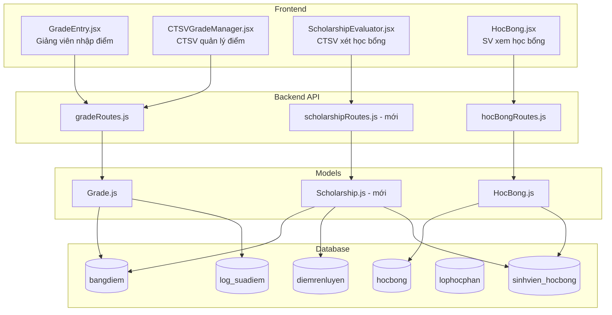

# Thiết kế: Nhập điểm sinh viên và xét học bổng tự động

## Tổng quan

Tính năng mở rộng hệ thống quản lý sinh viên hiện có để hỗ trợ:

1. **GradeSystem** – Giảng viên nhập điểm theo lớp học phần, CTSV quản lý điểm toàn trường, nhập hàng loạt qua Excel, khóa bảng điểm.
2. **ScholarshipEngine** – Xét học bổng tự động dựa trên GPA + DRL theo học kỳ, CTSV duyệt/từ chối, sinh viên xem kết quả.

Thiết kế tích hợp trực tiếp với các bảng DB hiện có (`bangdiem`, `diemrenluyen`, `hocbong`, `sinhvien_hocbong`, `lophocphan`) và mở rộng các route/model đã có (`gradeRoutes.js`, `hocBongRoutes.js`, `Grade.js`, `HocBong.js`).

---

## Kiến trúc



### Phân quyền

| Role | GradeSystem | ScholarshipEngine |
|------|-------------|-------------------|
| `giangvien` | Nhập/sửa điểm lớp mình phụ trách, khóa bảng điểm | Không có quyền |
| `ctsv` | Nhập/sửa điểm toàn trường, import Excel, mở khóa | Xét, duyệt, từ chối, xuất Excel |
| `sinhvien` | Xem điểm đã khóa của bản thân | Xem kết quả học bổng của bản thân |

---

## Thành phần và Giao diện

### Backend

#### gradeRoutes.js (mở rộng)

| Method | Path | Quyền | Mô tả |
|--------|------|-------|-------|
| GET | `/api/grades/class/:malophocphan` | giangvien, ctsv | Lấy danh sách điểm theo lớp học phần |
| PUT | `/api/grades/:id` | giangvien (lớp mình), ctsv | Cập nhật điểm một sinh viên |
| POST | `/api/grades/import-excel` | giangvien, ctsv | Nhập hàng loạt qua Excel |
| POST | `/api/grades/lock/:malophocphan` | giangvien (lớp mình), ctsv | Khóa bảng điểm |
| POST | `/api/grades/unlock/:malophocphan` | ctsv | Mở khóa bảng điểm |

**Middleware phân quyền giảng viên** – Trước khi xử lý PUT/lock, kiểm tra `lophocphan.magiaovien` khớp với `x-user-id` của giảng viên. Nếu không khớp → 403.

#### scholarshipRoutes.js (mới)

| Method | Path | Quyền | Mô tả |
|--------|------|-------|-------|
| POST | `/api/scholarship/evaluate/:mahocky` | ctsv | Chạy xét học bổng tự động |
| GET | `/api/scholarship/results/:mahocky` | ctsv | Xem kết quả xét học bổng |
| PUT | `/api/scholarship/approve/:id` | ctsv | Duyệt hoặc từ chối học bổng |
| GET | `/api/scholarship/my/:mahocky` | sinhvien | SV xem kết quả học bổng của mình |
| GET | `/api/scholarship/export/:mahocky` | ctsv | Xuất Excel danh sách học bổng |

#### Grade.js (mở rộng)

Thêm các method:

- `getByClassSectionWithAuth(malophocphan, userId, role)` – Kiểm tra quyền giảng viên
- `importFromExcel(rows, userId, role)` – Xử lý import hàng loạt, trả về `{ success, errors }`
- `unlock(malophocphan)` – Mở khóa bảng điểm (chỉ CTSV)

#### Scholarship.js (mới)

```javascript
class Scholarship {
  static classifyMucHocBong(gpa, drl)   // Phân loại theo tiêu chí
  static evaluateSemester(mahocky)       // Xét toàn bộ SV trong học kỳ
  static getResults(mahocky)             // Lấy kết quả đã xét
  static approve(id, nguoiduyet, ghichu) // Duyệt/từ chối
  static getByStudent(mssv, mahocky)     // SV xem kết quả của mình
  static exportExcel(mahocky)            // Xuất Excel
}
```

### Frontend

#### GradeEntry.jsx

- Giảng viên chọn lớp học phần từ dropdown (chỉ lớp mình phụ trách)
- Hiển thị bảng điểm dạng editable table: mssv, họ tên, chuyên cần, giữa kỳ, cuối kỳ, tổng kết (tính tự động), GPA
- Nút "Lưu điểm" (PUT từng dòng hoặc batch), nút "Khóa bảng điểm"
- Hiển thị badge trạng thái `dangnhap` / `dakhoa`

#### CTSVGradeManager.jsx

- Tìm kiếm lớp học phần theo học kỳ, môn học, giảng viên
- Xem và sửa điểm bất kỳ sinh viên
- Import Excel (upload → preview → confirm)
- Mở khóa bảng điểm đã khóa

#### ScholarshipEvaluator.jsx

- Chọn học kỳ → nhấn "Xét học bổng" → hiển thị kết quả phân nhóm theo mức
- Bảng kết quả: MSSV, họ tên, lớp, GPA, DRL, mức học bổng, trạng thái
- Nút duyệt/từ chối từng sinh viên (modal nhập lý do khi từ chối)
- Nút xuất Excel

#### HocBong.jsx (cập nhật)

- Thêm cột "Mức xếp loại" (`mucxeploai`) vào bảng lịch sử học bổng
- Hiển thị badge màu theo mức: Xuất sắc (xanh lá), Giỏi (xanh dương), Khá (vàng), Trung bình (cam)
- Hiển thị lý do từ chối nếu `trangthai = 'tuchoi'`

#### api.js (mở rộng)

```javascript
export const gradeAPI = {
  getByClass: (malophocphan) => api.get(`/grades/class/${malophocphan}`),
  update: (id, data) => api.put(`/grades/${id}`, data),
  importExcel: (file) => { /* multipart/form-data */ },
  lock: (malophocphan) => api.post(`/grades/lock/${malophocphan}`),
  unlock: (malophocphan) => api.post(`/grades/unlock/${malophocphan}`),
};

export const scholarshipAPI = {
  evaluate: (mahocky) => api.post(`/scholarship/evaluate/${mahocky}`),
  getResults: (mahocky) => api.get(`/scholarship/results/${mahocky}`),
  approve: (id, data) => api.put(`/scholarship/approve/${id}`, data),
  getMy: (mahocky) => api.get(`/scholarship/my/${mahocky}`),
  exportExcel: (mahocky) => api.get(`/scholarship/export/${mahocky}`, { responseType: 'blob' }),
};
```

---

## Mô hình dữ liệu

### Bảng hiện có (sử dụng không thay đổi schema)

**bangdiem**
```
mabangdiem | malophocphan | mssv | diemchuyencan | diemgiuaky | diemcuoiky
diemtongket | gpa | trangthai (dangnhap|dakhoa) | canhbao | nguoinhap | ngaykhoa
```

**diemrenluyen**
```
madiemrenluyen | mssv | mahocky | diemtong | xeploai
```

**sinhvien_hocbong** – Thêm cột `mucxeploai` nếu chưa có
```
id | mssv | mahocbong | mucxeploai | trangthai (duyet|tuchoi) | ghichu | nguoiduyet | ngayduyet
```

**hocbong**
```
mahocbong | tenhocbong | mahocky | sotien | trangthai
```

### Migration cần thêm

```sql
-- Thêm cột mucxeploai vào sinhvien_hocbong nếu chưa có
ALTER TABLE sinhvien_hocbong
  ADD COLUMN IF NOT EXISTS mucxeploai 
    ENUM('xuat_sac','gioi','kha','trung_binh','khong_du_dieu_kien') 
    DEFAULT NULL AFTER mahocbong,
  ADD COLUMN IF NOT EXISTS nguoiduyet VARCHAR(50) DEFAULT NULL,
  ADD COLUMN IF NOT EXISTS ngayduyet DATETIME DEFAULT NULL;
```

### Logic phân loại học bổng

```javascript
function classifyMucHocBong(gpa, drl) {
  if (gpa === null || drl === null) return 'khong_du_dieu_kien';
  if (gpa >= 3.6 && drl >= 80) return 'xuat_sac';
  if (gpa >= 3.2 && drl >= 80) return 'gioi';
  if (gpa >= 3.2 && drl >= 65) return 'kha';
  if (gpa >= 2.5 && drl >= 50) return 'trung_binh';
  return 'khong_du_dieu_kien';
}
```

### Tính GPA học kỳ (dùng cho xét học bổng)

GPA học kỳ = trung bình có trọng số theo số tín chỉ của tất cả môn trong học kỳ:

```sql
SELECT b.mssv,
  SUM(b.gpa * m.sotinchi) / SUM(m.sotinchi) AS gpa_hocky
FROM bangdiem b
JOIN lophocphan l ON b.malophocphan = l.malophocphan
JOIN monhoc m ON l.mamonhoc = m.mamonhoc
WHERE l.mahocky = ? AND b.trangthai = 'dakhoa'
GROUP BY b.mssv
```

### Cấu trúc response import Excel

```json
{
  "total": 30,
  "success": 28,
  "errors": [
    { "row": 5, "mssv": "20123999", "message": "MSSV không tồn tại" },
    { "row": 12, "mssv": "20123456", "message": "diemcuoiky ngoài khoảng [0,10]" }
  ]
}
```

---

## Xử lý lỗi

| Tình huống | HTTP Status | Message |
|-----------|-------------|---------|
| Giảng viên nhập điểm lớp không phụ trách | 403 | "Bạn không có quyền nhập điểm cho lớp học phần này" |
| Điểm ngoài khoảng [0, 10] | 400 | "Điểm {field} phải nằm trong khoảng [0, 10]" |
| Bảng điểm đã khóa | 400 | "Bảng điểm đã khóa, không thể sửa" |
| File Excel thiếu cột bắt buộc | 400 | "File Excel thiếu cột bắt buộc: {columns}" |
| MSSV không tồn tại (import) | Ghi vào errors list | "MSSV không tồn tại" |
| Sinh viên không có DRL | — | Xếp "Không đủ điều kiện" |
| Sinh viên không có GPA | — | Xếp "Không đủ điều kiện" |
| Từ chối học bổng không có lý do | 400 | "Vui lòng nhập lý do từ chối" |

---

## Correctness Properties

*A property is a characteristic or behavior that should hold true across all valid executions of a system — essentially, a formal statement about what the system should do. Properties serve as the bridge between human-readable specifications and machine-verifiable correctness guarantees.*

### Property 1: Phân quyền nhập điểm

*For any* giảng viên và lớp học phần, nếu `lophocphan.magiaovien` không khớp với ID của giảng viên đó, thì mọi yêu cầu nhập/sửa điểm cho lớp đó phải trả về HTTP 403. Ngược lại, CTSV phải được phép nhập/sửa điểm cho bất kỳ lớp học phần nào.

**Validates: Requirements 1.1, 1.4, 2.1**

---

### Property 2: Tính điểm đúng công thức

*For any* bộ điểm hợp lệ `(diemchuyencan, diemgiuaky, diemcuoiky)` trong khoảng `[0, 10]`, sau khi lưu, hệ thống phải tính và lưu:
- `diemtongket = diemchuyencan * 0.1 + diemgiuaky * 0.3 + diemcuoiky * 0.6`
- `gpa = round((diemtongket / 10) * 4, 2)`

Cả hai giá trị phải có mặt trong response.

**Validates: Requirements 1.2, 1.5, 4.1, 4.3**

---

### Property 3: Validation điểm ngoài khoảng

*For any* giá trị điểm `d` thỏa `d < 0` hoặc `d > 10`, hệ thống phải từ chối lưu và trả về lỗi mô tả rõ trường điểm không hợp lệ. Khi `diemtongket` ngoài `[0, 10]`, `gpa` phải là `null`.

**Validates: Requirements 1.3, 4.4**

---

### Property 4: Bảng điểm khóa không thể sửa

*For any* bảng điểm có `trangthai = 'dakhoa'`, mọi yêu cầu cập nhật điểm (dù từ giảng viên hay CTSV) phải bị từ chối với thông báo lỗi phù hợp.

**Validates: Requirements 1.6**

---

### Property 5: Ghi log khi sửa điểm

*For any* lần sửa điểm thành công, bảng `log_suadiem` phải chứa ít nhất một bản ghi với `mabangdiem` tương ứng, ghi nhận trường thay đổi, giá trị cũ, giá trị mới và người sửa.

**Validates: Requirements 2.2**

---

### Property 6: Import Excel xử lý đúng

*For any* file Excel nhập điểm chứa hỗn hợp dòng hợp lệ và không hợp lệ, hệ thống phải:
- Lưu tất cả dòng hợp lệ vào DB
- Trả về danh sách lỗi với số dòng và mô tả cụ thể cho từng dòng không hợp lệ (MSSV không tồn tại, điểm ngoài khoảng, thiếu cột bắt buộc)
- Tổng `success + errors.length = total_rows`

**Validates: Requirements 2.3, 2.4, 8.2, 8.3, 8.4**

---

### Property 7: Mở khóa bảng điểm round-trip

*For any* bảng điểm, sau khi khóa (`trangthai = 'dakhoa'`) rồi mở khóa, `trangthai` phải trở về `'dangnhap'` và điểm có thể được sửa lại bình thường.

**Validates: Requirements 2.5**

---

### Property 8: Cách ly dữ liệu theo người dùng

*For any* sinh viên S, mọi response từ API điểm và API học bổng khi được gọi với token của S phải chỉ chứa dữ liệu có `mssv = S.mssv`, không bao giờ chứa dữ liệu của sinh viên khác.

**Validates: Requirements 3.1, 7.1**

---

### Property 9: Sinh viên không thấy điểm đang nhập

*For any* sinh viên, danh sách điểm trả về qua API dành cho sinh viên phải chỉ chứa các bản ghi có `trangthai = 'dakhoa'`. Không có bản ghi nào có `trangthai = 'dangnhap'` được trả về.

**Validates: Requirements 3.3**

---

### Property 10: Phân loại học bổng đúng tiêu chí

*For any* cặp `(gpa, drl)`, hàm `classifyMucHocBong` phải trả về đúng mức theo bảng tiêu chí:
- `gpa >= 3.6 AND drl >= 80` → `xuat_sac`
- `gpa >= 3.2 AND drl >= 80` → `gioi`
- `gpa >= 3.2 AND drl >= 65` → `kha`
- `gpa >= 2.5 AND drl >= 50` → `trung_binh`
- `gpa = null OR drl = null` hoặc không thỏa điều kiện nào → `khong_du_dieu_kien`

**Validates: Requirements 5.2, 5.4, 5.5**

---

### Property 11: Kết quả xét học bổng sắp xếp đúng thứ tự

*For any* kết quả xét học bổng của một học kỳ, danh sách sinh viên phải được sắp xếp theo thứ tự mức học bổng giảm dần: `xuat_sac > gioi > kha > trung_binh > khong_du_dieu_kien`.

**Validates: Requirements 5.3**

---

### Property 12: Duyệt/từ chối cập nhật trạng thái đúng

*For any* bản ghi `sinhvien_hocbong`, sau khi CTSV duyệt, `trangthai` phải là `'duyet'` và `nguoiduyet`, `ngayduyet` phải được ghi nhận. Sau khi từ chối, `trangthai` phải là `'tuchoi'` và `ghichu` phải chứa lý do từ chối.

**Validates: Requirements 6.1, 6.2**

---

### Property 13: Round-trip import Excel

*For any* file Excel hợp lệ chứa dữ liệu điểm, sau khi import thành công và truy vấn lại từ DB, dữ liệu điểm trả về phải tương đương với dữ liệu trong file (cùng `mssv`, `malophocphan`, `diemchuyencan`, `diemgiuaky`, `diemcuoiky`).

**Validates: Requirements 8.5**

---

## Chiến lược kiểm thử

### Dual Testing Approach

Sử dụng kết hợp **unit tests** và **property-based tests** để đảm bảo độ phủ toàn diện.

**Unit tests** tập trung vào:
- Các ví dụ cụ thể: tính điểm với bộ số cố định, phân loại học bổng với boundary values
- Integration points: API route → model → DB
- Edge cases: file Excel rỗng, SV không có DRL, bảng điểm đã khóa

**Property-based tests** tập trung vào:
- Tất cả 13 correctness properties ở trên
- Mỗi property chạy tối thiểu **100 iterations**

### Thư viện PBT

- **Backend (Node.js)**: [`fast-check`](https://github.com/dubzzz/fast-check)

```bash
npm install --save-dev fast-check
```

### Cấu hình property tests

Mỗi property test phải có comment tag theo format:

```javascript
// Feature: grade-scholarship-management, Property 2: Tính điểm đúng công thức
test('tính điểm đúng công thức', () => {
  fc.assert(
    fc.property(
      fc.float({ min: 0, max: 10 }),
      fc.float({ min: 0, max: 10 }),
      fc.float({ min: 0, max: 10 }),
      (cc, gk, ck) => {
        const expected = cc * 0.1 + gk * 0.3 + ck * 0.6;
        const result = Grade._tinhDiemTongKet(cc, gk, ck);
        return Math.abs(result - expected) < 0.001;
      }
    ),
    { numRuns: 100 }
  );
});
```

### Phân bổ test theo module

| Module | Unit Tests | Property Tests |
|--------|-----------|----------------|
| `Grade._tinhDiemTongKet` | Boundary values (0, 5, 10) | P2, P3 |
| `Grade.updateGrade` | Khóa bảng điểm, log ghi đúng | P4, P5 |
| `Grade.importFromExcel` | File hợp lệ, file lỗi định dạng | P6, P13 |
| `Grade.lock / unlock` | Trạng thái sau lock/unlock | P7 |
| `Scholarship.classifyMucHocBong` | Tất cả boundary GPA/DRL | P10 |
| `Scholarship.evaluateSemester` | Học kỳ có/không có SV | P11 |
| `Scholarship.approve` | Duyệt, từ chối có/không lý do | P12 |
| API `/grades` (auth) | GV đúng lớp, GV sai lớp, CTSV | P1 |
| API `/grades` (student view) | SV chỉ thấy điểm mình, chỉ thấy dakhoa | P8, P9 |
