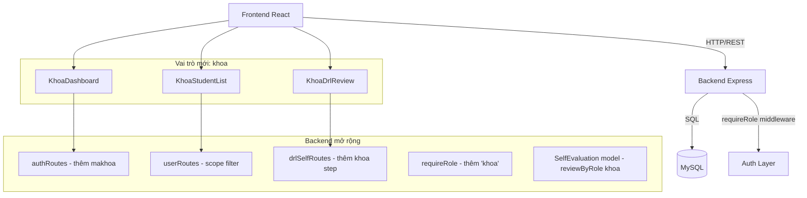
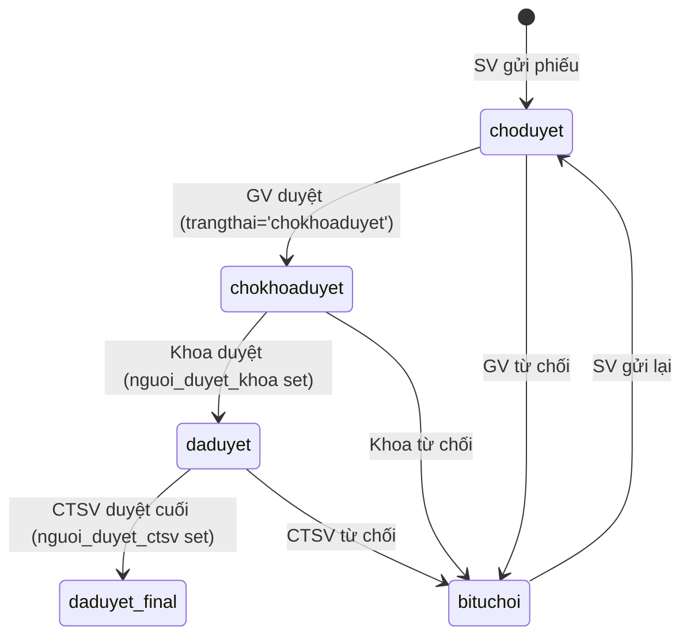

# Tài Liệu Thiết Kế: khoa-role-permission

## Tổng Quan

Tính năng này bổ sung vai trò `khoa` vào hệ thống quản lý sinh viên (Node.js/Express + MySQL + React). Vai trò `khoa` đại diện cho cán bộ quản lý cấp khoa/ngành, được gắn với một `makhoa` cụ thể và chỉ truy cập dữ liệu sinh viên thuộc khoa đó.

Thay đổi lớn nhất là quy trình duyệt DRL được mở rộng từ 3 bước thành 4 bước:

```
Sinh viên → Giảng viên (bước 1) → Khoa (bước 2) → CTSV (bước cuối)
```

Hệ thống hiện tại đã có nền tảng tốt: middleware `requireRole`, token-based auth, model `SelfEvaluation` với `reviewByRole`. Thiết kế này tận dụng tối đa cấu trúc hiện có và chỉ mở rộng những gì cần thiết.

---

## Kiến Trúc

### Tổng Quan Kiến Trúc



### Luồng Duyệt DRL Mới



**Lưu ý tương thích ngược**: Phiếu cũ có `trangthai='daduyet'` và `nguoi_duyet_ctsv IS NULL` nhưng `nguoi_duyet_khoa IS NULL` vẫn được CTSV xem và duyệt bình thường (không bị chặn bởi logic mới).

---

## Các Thành Phần và Giao Diện

### Backend

#### 1. Database Migration (`backend/database/06_khoa_role.sql`)

Thêm cột vào bảng `users`:
- `makhoa VARCHAR(50) DEFAULT NULL`
- Mở rộng ENUM `role` để chấp nhận `'khoa'`

Thêm cột vào bảng `drl_tudanhgia`:
- `diem_khoa INT DEFAULT NULL`
- `nhan_xet_khoa TEXT NULL`
- `nguoi_duyet_khoa VARCHAR(50) NULL`
- `ngay_duyet_khoa DATETIME NULL`
- Mở rộng ENUM `trangthai` để chấp nhận `'chokhoaduyet'`

#### 2. Middleware (`backend/middleware/requireRole.js`)

Cập nhật để expose `req.user.makhoa` từ token/header. Không thay đổi interface hiện có, chỉ thêm `makhoa` vào `req.user`.

```javascript
// Thêm vào parseUser hoặc requireRole:
// req.user = { id, role, username, makhoa }
```

#### 3. Auth Routes (`backend/routes/authRoutes.js`)

- `selectStaffByUsernameAndPassword`: thêm `makhoa` vào SELECT
- `selectStaffById`: thêm `makhoa` vào SELECT
- `/api/auth/me`: trả về `makhoa` trong response

#### 4. User Routes (`backend/routes/userRoutes.js`)

- `GET /api/users`: hỗ trợ filter `role=khoa`, trả về `makhoa`
- `POST /api/users`: validate `makhoa` bắt buộc khi `role='khoa'`
- `PUT /api/users/:id`: hỗ trợ cập nhật `makhoa`, validate tồn tại
- `GET /api/users/students/all`: filter theo `makhoa` của user nếu `role='khoa'`
- `GET /api/users/students/profile/:mssv`: kiểm tra `makhoa` nếu `role='khoa'`

#### 5. DRL Self Routes (`backend/routes/drlSelfRoutes.js`)

- `GET /class/:malop/semester/:mahocky`: thêm `'khoa'` vào `requireRole`, thêm filter logic cho role `khoa`
- `PUT /:id/review`: thêm `'khoa'` vào `requireRole`, thêm case `khoa` trong handler

#### 6. SelfEvaluation Model (`backend/models/SelfEvaluation.js`)

- `reviewByRole`: thêm case `role === 'khoa'` để cập nhật `diem_khoa`, `nhan_xet_khoa`, `nguoi_duyet_khoa`, `ngay_duyet_khoa`
- Khi GV duyệt: `trangthai` chuyển sang `'chokhoaduyet'` thay vì `'daduyet'`
- `getPendingByClassAndSemester`: thêm filter `makhoa` khi role là `khoa`

### Frontend

#### 1. App.jsx

Thêm routes mới:
- `/khoa/dashboard` → `KhoaDashboard` (requiredRole="khoa")
- `/khoa/drl-review` → `KhoaDrlReview` (requiredRole="khoa")
- `/khoa/students` → `KhoaStudentList` (requiredRole="khoa")

#### 2. AuthContext.jsx / Home.jsx

Thêm redirect logic cho role `khoa` → `/khoa/dashboard`.

#### 3. AdminUsers.jsx

- Thêm `'khoa'` vào dropdown vai trò
- Hiển thị field `makhoa` khi chọn role `'khoa'`
- Thêm `'khoa'` vào filter dropdown

#### 4. DrlSelfEvaluation.jsx

- Cập nhật `statusLabel` để xử lý `'chokhoaduyet'`
- Hiển thị `diem_khoa`, `nhan_xet_khoa` khi có

#### 5. DrlClassReview.jsx

- Cập nhật `statusLabel`: `'daduyet'` sau GV → `'Chờ Khoa duyệt'`
- CTSV: chỉ hiển thị phiếu có `nguoi_duyet_khoa IS NOT NULL`
- Thêm cột `Điểm Khoa` cho CTSV/Admin
- Hiển thị `diem_khoa`, `nhan_xet_khoa` trong chi tiết phiếu

#### 6. KhoaDashboard.jsx (mới)

Dashboard cho vai trò `khoa` với:
- Thông tin tài khoản (tên, makhoa)
- Số phiếu DRL chờ duyệt
- Links điều hướng

#### 7. KhoaDrlReview.jsx (mới)

Trang duyệt DRL cho khoa, tương tự `DrlClassReview` nhưng:
- Chỉ hiển thị phiếu `trangthai='chokhoaduyet'` thuộc khoa
- Form duyệt với `diem_khoa` (0-100) và `nhan_xet_khoa`

#### 8. KhoaStudentList.jsx (mới)

Danh sách sinh viên thuộc khoa với tìm kiếm và xem hồ sơ.

---

## Mô Hình Dữ Liệu

### Bảng `users` (sau migration)

| Cột | Kiểu | Ghi chú |
|-----|------|---------|
| id | INT PK | |
| username | VARCHAR(50) | |
| password | VARCHAR(255) | |
| hoten | VARCHAR(100) | |
| email | VARCHAR(100) | |
| role | ENUM('admin','giangvien','ctsv','khoa') | Thêm 'khoa' |
| makhoa | VARCHAR(50) DEFAULT NULL | Mới - bắt buộc khi role='khoa' |
| magiangvien | VARCHAR(50) | Hiện có |
| status | ENUM('active','inactive') | |
| created_at | DATETIME | |

### Bảng `drl_tudanhgia` (sau migration)

| Cột | Kiểu | Ghi chú |
|-----|------|---------|
| id | INT PK | |
| mssv | VARCHAR(20) | |
| mahocky | VARCHAR(20) | |
| ... | ... | Các cột hiện có |
| trangthai | ENUM('choduyet','daduyet','bituchoi','chokhoaduyet') | Thêm 'chokhoaduyet' |
| diem_cvht | INT | Hiện có |
| nhan_xet_cvht | TEXT | Hiện có |
| nguoi_duyet_cvht | VARCHAR(50) | Hiện có |
| ngay_duyet_cvht | DATETIME | Hiện có |
| diem_khoa | INT DEFAULT NULL | Mới |
| nhan_xet_khoa | TEXT NULL | Mới |
| nguoi_duyet_khoa | VARCHAR(50) NULL | Mới |
| ngay_duyet_khoa | DATETIME NULL | Mới |
| diem_ctsv | INT | Hiện có |
| nhan_xet_ctsv | TEXT | Hiện có |
| nguoi_duyet_ctsv | VARCHAR(50) | Hiện có |
| ngay_duyet_ctsv | DATETIME | Hiện có |

### Logic Phân Quyền Dữ Liệu

```
GET /api/users/students/all:
  - role='admin' hoặc 'ctsv': trả về tất cả
  - role='khoa': WHERE sinhvien.makhoa = req.user.makhoa
  - role='giangvien': không có quyền (403)

GET /api/drl-self/class/:malop/semester/:mahocky:
  - role='admin': tất cả phiếu
  - role='giangvien': trangthai IN ('choduyet','bituchoi')
  - role='khoa': trangthai='chokhoaduyet' AND makhoa=req.user.makhoa
  - role='ctsv': trangthai='daduyet' AND (nguoi_duyet_khoa IS NOT NULL OR nguoi_duyet_ctsv IS NULL)
```

---

## Thuộc Tính Đúng Đắn (Correctness Properties)

*A property is a characteristic or behavior that should hold true across all valid executions of a system — essentially, a formal statement about what the system should do. Properties serve as the bridge between human-readable specifications and machine-verifiable correctness guarantees.*

### Property 1: Tài khoản khoa phải có makhoa

*For any* yêu cầu tạo tài khoản với `role='khoa'` và `makhoa=NULL` hoặc `makhoa=''`, hệ thống phải từ chối với HTTP 400.

**Validates: Requirements 1.3, 3.2**

### Property 2: Tài khoản không phải khoa được phép makhoa NULL

*For any* yêu cầu tạo tài khoản với `role` khác `'khoa'` (admin, giangvien, ctsv), hệ thống phải chấp nhận kể cả khi `makhoa=NULL`.

**Validates: Requirements 1.4**

### Property 3: Đăng nhập khoa trả về makhoa

*For any* tài khoản có `role='khoa'`, sau khi đăng nhập thành công, response phải chứa trường `makhoa` và `access_token` có dạng `staff-{id}-khoa`.

**Validates: Requirements 2.1, 2.2**

### Property 4: Middleware từ chối role không được phép

*For any* HTTP request tới endpoint được bảo vệ bởi `requireRole(roles)` mà `roles` không chứa role của người dùng, middleware phải trả về HTTP 403.

**Validates: Requirements 2.4**

### Property 5: Tạo tài khoản khoa hợp lệ thành công

*For any* dữ liệu tài khoản hợp lệ với `role='khoa'` và `makhoa` tồn tại trong bảng `sinhvien`, yêu cầu POST `/api/users` phải trả về HTTP 201 và tài khoản phải tồn tại trong database.

**Validates: Requirements 3.1**

### Property 6: Filter danh sách users theo role trả về đúng

*For any* query `GET /api/users?role=khoa`, tất cả records trả về phải có `role='khoa'` và phải chứa trường `makhoa`.

**Validates: Requirements 3.3**

### Property 7: Cập nhật tài khoản khoa lưu đúng dữ liệu

*For any* tài khoản `khoa` và dữ liệu cập nhật hợp lệ (`hoten`, `email`, `status`, `makhoa`), sau khi PUT thành công, GET lại tài khoản đó phải trả về đúng dữ liệu đã cập nhật (round-trip).

**Validates: Requirements 3.4**

### Property 8: Khoa_Manager chỉ thấy sinh viên của khoa mình

*For any* Khoa_Manager với `makhoa=X`, tất cả sinh viên trả về từ `GET /api/users/students/all` phải có `makhoa=X`.

**Validates: Requirements 4.1, 4.5**

### Property 9: Admin và CTSV thấy tất cả sinh viên

*For any* request từ tài khoản `admin` hoặc `ctsv`, `GET /api/users/students/all` phải trả về toàn bộ sinh viên không phân biệt khoa.

**Validates: Requirements 4.3, 4.4**

### Property 10: Khoa_Manager bị 403 khi xem sinh viên khoa khác

*For any* Khoa_Manager với `makhoa=X` và sinh viên có `makhoa=Y` (X ≠ Y), `GET /api/users/students/profile/:mssv` phải trả về HTTP 403.

**Validates: Requirements 4.2**

### Property 11: GV duyệt chuyển trạng thái sang chokhoaduyet

*For any* phiếu DRL có `trangthai='choduyet'`, sau khi Giảng viên duyệt (PUT review với trangthai='daduyet'), `trangthai` của phiếu phải là `'chokhoaduyet'`.

**Validates: Requirements 5.1**

### Property 12: Mỗi role thấy đúng tập phiếu DRL

*For any* query `GET /api/drl-self/class/:malop/semester/:mahocky`:
- Giảng viên: tất cả phiếu trả về phải có `trangthai IN ('choduyet','bituchoi')`
- Khoa_Manager: tất cả phiếu trả về phải có `trangthai='chokhoaduyet'` và `makhoa` khớp với Khoa_Manager
- CTSV: tất cả phiếu trả về phải có `trangthai='daduyet'` và `nguoi_duyet_khoa IS NOT NULL` (hoặc là phiếu cũ tương thích ngược)

**Validates: Requirements 5.2, 5.6, 5.7**

### Property 13: Khoa review cập nhật đúng fields

*For any* phiếu DRL có `trangthai='chokhoaduyet'` và Khoa_Manager thuộc đúng khoa, sau khi PUT review thành công, phiếu phải có `nguoi_duyet_khoa`, `ngay_duyet_khoa` được set và `trangthai` chuyển sang giá trị đúng (`'daduyet'` hoặc `'bituchoi'`).

**Validates: Requirements 5.3, 5.4**

### Property 14: Khoa_Manager bị 403 khi duyệt phiếu khoa khác

*For any* Khoa_Manager với `makhoa=X` và phiếu DRL của sinh viên có `makhoa=Y` (X ≠ Y), PUT review phải trả về HTTP 403.

**Validates: Requirements 5.5**

### Property 15: Thứ tự duyệt tuần tự được đảm bảo

*For any* phiếu DRL chưa qua bước khoa (`nguoi_duyet_khoa IS NULL`), yêu cầu CTSV duyệt phải trả về HTTP 400.

**Validates: Requirements 5.8**

### Property 16: Request không có token hợp lệ bị từ chối

*For any* HTTP request tới endpoint duyệt DRL không có Authorization header hợp lệ, hệ thống phải trả về HTTP 401.

**Validates: Requirements 11.2**

### Property 17: Log hành động duyệt DRL được ghi đầy đủ

*For any* hành động duyệt/từ chối phiếu DRL của Khoa_Manager, log phải được ghi với đầy đủ: `id phiếu`, `mssv`, `username người duyệt`, `makhoa`, `thời gian`, `kết quả`.

**Validates: Requirements 11.4**

### Property 18: Migration giữ nguyên dữ liệu hiện có

*For any* database có dữ liệu DRL hiện tại, sau khi chạy migration `06_khoa_role.sql`, số lượng records trong `drl_tudanhgia` phải không thay đổi và `trangthai` của các phiếu cũ phải giữ nguyên.

**Validates: Requirements 12.1, 12.2**

### Property 19: Tương thích ngược với phiếu DRL cũ

*For any* phiếu DRL cũ có `trangthai='daduyet'` và `nguoi_duyet_ctsv IS NULL` và `nguoi_duyet_khoa IS NULL`, CTSV vẫn phải thấy và có thể duyệt phiếu đó (không bị chặn bởi logic mới).

**Validates: Requirements 12.3**

---

## Xử Lý Lỗi

### Backend

| Tình huống | HTTP Code | Message |
|-----------|-----------|---------|
| Tạo tài khoản khoa thiếu makhoa | 400 | `'Tài khoản vai trò khoa phải có makhoa'` |
| makhoa không tồn tại trong sinhvien | 400 | `'makhoa không hợp lệ hoặc không tồn tại'` |
| Khoa_Manager xem sinh viên khoa khác | 403 | `'Không có quyền truy cập sinh viên khoa khác'` |
| Khoa_Manager duyệt phiếu khoa khác | 403 | `'Không có quyền duyệt phiếu của khoa khác'` |
| Duyệt sai thứ tự workflow | 400 | `'Phiếu chưa đến bước duyệt của bạn'` |
| Không có token | 401 | `'Chưa đăng nhập'` |
| Role không được phép | 403 | `'Bạn không có quyền truy cập chức năng này'` |

### Frontend

- Lỗi 403: hiển thị thông báo "Không có quyền truy cập" và redirect về dashboard của role
- Lỗi 400: hiển thị message từ server trong form
- Lỗi 401: redirect về trang login

---

## Chiến Lược Kiểm Thử

### Dual Testing Approach

Sử dụng cả unit tests và property-based tests:
- **Unit tests**: kiểm tra các ví dụ cụ thể, edge cases, UI rendering
- **Property tests**: kiểm tra các thuộc tính phổ quát trên nhiều inputs

### Unit Tests

**Backend:**
- `authRoutes`: test login với role='khoa' trả về makhoa
- `userRoutes`: test tạo user khoa thiếu makhoa → 400; tạo hợp lệ → 201
- `drlSelfRoutes`: test filter theo role (GV/Khoa/CTSV)
- `requireRole`: test với role='khoa' được chấp nhận/từ chối đúng
- `SelfEvaluation.reviewByRole`: test case 'khoa' cập nhật đúng fields

**Frontend:**
- `AdminUsers`: render dropdown có option 'khoa'; field makhoa xuất hiện khi chọn role='khoa'
- `DrlSelfEvaluation`: statusLabel với 'chokhoaduyet' → 'Chờ Khoa duyệt'
- `DrlClassReview`: CTSV thấy cột Điểm Khoa; statusLabel sau GV duyệt
- `KhoaDashboard`: render đúng makhoa và links
- `KhoaDrlReview`: form có field diem_khoa và nhan_xet_khoa

### Property-Based Tests

Sử dụng thư viện **fast-check** (JavaScript/Node.js) cho backend và **@fast-check/jest** cho frontend.

Cấu hình: tối thiểu 100 iterations mỗi property test.

**Property 1: Tài khoản khoa phải có makhoa**
```javascript
// Feature: khoa-role-permission, Property 1: khoa account requires makhoa
fc.assert(fc.asyncProperty(
  fc.record({ username: fc.string(), password: fc.string(), hoten: fc.string() }),
  async (userData) => {
    const res = await request(app).post('/api/users')
      .send({ ...userData, role: 'khoa', makhoa: null });
    return res.status === 400;
  }
), { numRuns: 100 });
```

**Property 4: Middleware từ chối role không được phép**
```javascript
// Feature: khoa-role-permission, Property 4: middleware rejects unauthorized role
fc.assert(fc.asyncProperty(
  fc.constantFrom('admin', 'giangvien', 'ctsv', 'sinhvien'),
  async (role) => {
    const res = await request(app)
      .get('/api/drl-self/class/test/semester/test')
      .set('x-user-role', role === 'khoa' ? 'sinhvien' : role);
    // endpoint chỉ cho phép ['admin','giangvien','ctsv','khoa']
    // test với role không trong list
    return true; // kiểm tra logic cụ thể
  }
), { numRuns: 100 });
```

**Property 8: Khoa_Manager chỉ thấy sinh viên của khoa mình**
```javascript
// Feature: khoa-role-permission, Property 8: khoa manager sees only own faculty students
fc.assert(fc.asyncProperty(
  fc.string({ minLength: 2, maxLength: 10 }),
  async (makhoa) => {
    const students = await getStudentsAsKhoa(makhoa);
    return students.every(s => s.makhoa === makhoa);
  }
), { numRuns: 100 });
```

**Property 11: GV duyệt chuyển trạng thái sang chokhoaduyet**
```javascript
// Feature: khoa-role-permission, Property 11: GV approval transitions to chokhoaduyet
fc.assert(fc.asyncProperty(
  fc.record({ diem_cvht: fc.integer({ min: 0, max: 100 }), nhan_xet_cvht: fc.string() }),
  async (reviewData) => {
    const phieu = await createPhieuChoduyet();
    await reviewAsGiangvien(phieu.id, { ...reviewData, trangthai: 'daduyet' });
    const updated = await getPhieu(phieu.id);
    return updated.trangthai === 'chokhoaduyet';
  }
), { numRuns: 100 });
```

**Property 18: Migration giữ nguyên dữ liệu**
```javascript
// Feature: khoa-role-permission, Property 18: migration preserves existing DRL records
// Test: đếm records trước và sau migration, so sánh
fc.assert(fc.asyncProperty(
  fc.array(fc.record({ mssv: fc.string(), mahocky: fc.string() }), { minLength: 1, maxLength: 20 }),
  async (records) => {
    const countBefore = await countDrlRecords();
    await runMigration();
    const countAfter = await countDrlRecords();
    return countBefore === countAfter;
  }
), { numRuns: 100 });
```

Mỗi correctness property trong tài liệu này phải được implement bởi đúng một property-based test với tag:
`// Feature: khoa-role-permission, Property {N}: {property_text}`
